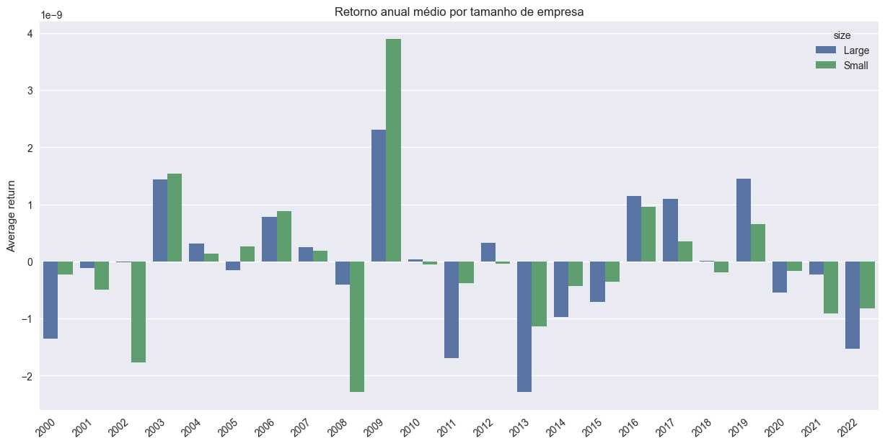

This part of the project documentation focuses on a
**problem-oriented** approach. You'll tackle common
tasks that you might have, with the help of the code
provided in this project.

## Passos iniciais

Para utilizar os módulos implementados o _FICO_ siga as etapas abaixo:

### Instalação

```bash
poetry add git+https://github.com/fico-ita/po_245_2023_T1.git
```

### Uso

Os pacotes implementados podem ser importados da forma:

```python
>>> from fico.portfolio import choose_stock, process_stock
>>> from fico.evaluation import *
```

## Como Calcular o retorno anual médio por tamanho de empresa:

```python
import pandas as pd
import seaborn as sns
from fico.evaluation import *
from fico.portfolio import *

universe = pd.read_csv("../data/ibov_universe.csv", index_col=None)


universe = Portifolio(universe)
data = universe.pre_processing()
numeric_columns = universe.numeric_columns
data["size"] = (
    data.groupby("date")["mkt_value"]
    .apply(lambda x: (x > x.median()))
    .reset_index(drop=True)
    .replace({True: "Large", False: "Small"})
)
data["year"] = data["date"].dt.year

return_by_size = data.groupby(["year", "size"])["ret12m"].mean().reset_index()

ax = sns.barplot(x="year", y="ret12m", hue="size", data=return_by_size)
ax.set(xlabel="", ylabel="Average return")
ax.set_xticklabels(ax.get_xticklabels(), rotation=40, ha="right")
plt.show()
```


